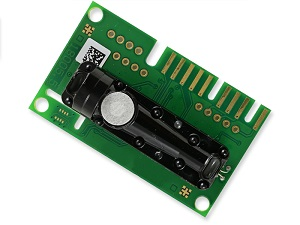
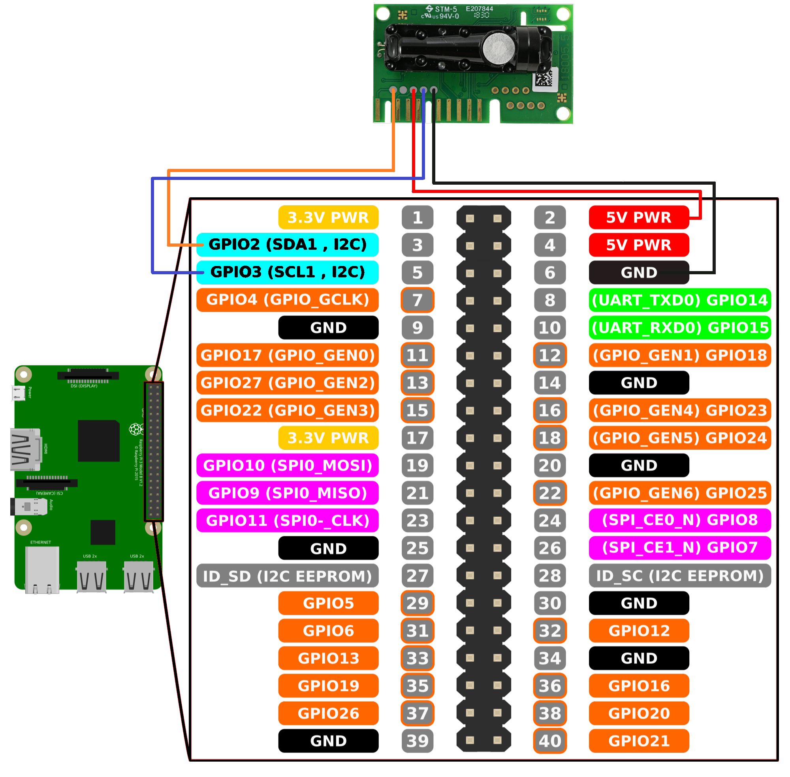
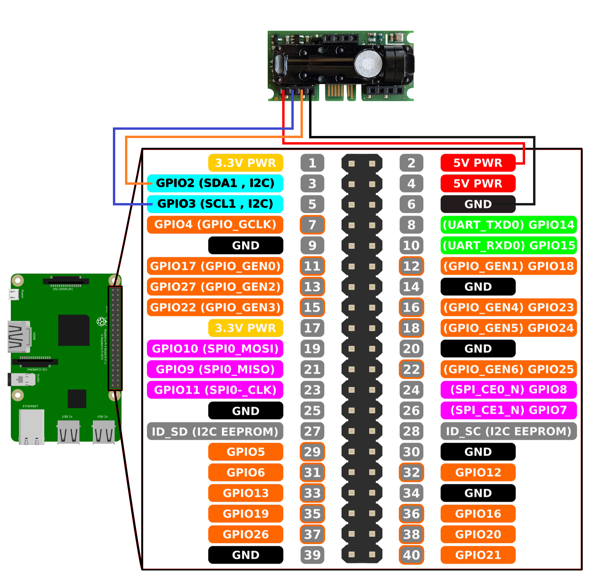
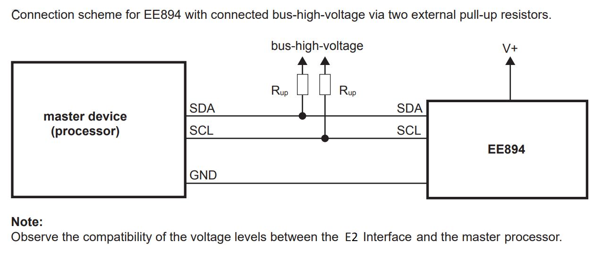

[](https://www.epluse.com/en/)

# EE894 E2 with Raspberry Pi 

|Standard | Compact|
|------------ | ------------|
| | |


[](https://www.epluse.com/en/products/co2-measurement/co2-sensor/ee894/)   [](https://downloads.epluse.com/fileadmin/data/product/ee894/datasheet_EE894.pdf) 


## QUICK START GUIDE  

### Required components 
- EE894
- Raspberry Pi 4
- Breadboard
- Wire jumper cable

| Step |                                                                                                                                                             |
|------|-------------------------------------------------------------------------------------------------------------------------------------------------------------|
| 1    | Connect the EE894 sensor module with Raspberry Pi according to the following scheme: <br> __Standard:__ [](images/EE894_rpi.png)  __Compact:__ [](images/EE894_comp_rpi.png)|
| 2    | Download and install the operating system (https://www.raspberrypi.org/software/operating-systems/).                                                            |
| 3    | Boot Raspberry Pi and complete any first-time setup if necessary (find instructions online).                                                                |
| 4    | Download and install the "RPi.GPIO" library on the Raspberry Pi. [Instruction](https://pypi.org/project/RPi.GPIO/)            |
| 5    | Clone the repository: ```git clone https://github.com/EplusE/ee894_e2_rpi.git```             |
| 6    | Open a command shell and execute the main python script [*ee894_e2_rpi_program.py*](ee894_e2_rpi_program.py)  |

<br>

### Example output

According to the *datasheet* after a reset the module starts the first measurement after 5 s to 15 s. The timing (tpwrup) is defined by a randomizer and is specific for each EE894. The randomizer is constant for each power up but varies from module to module. 

```shell
pi@raspberrypi:~ $ python3 ee894_e2_example.py
Sensor type: 894
Sensor sub-type: 9
Available measurands (bitmask): 0b1111
temperature , relative humidity , co2 , pressure
27.23 °C , 37.52 %RH , 987 ppm , 983.3 mbar
27.26 °C , 37.51 %RH , 990 ppm , 983.4 mbar
27.26 °C , 37.51 %RH , 990 ppm , 983.4 mbar
27.26 °C , 37.51 %RH , 990 ppm , 983.4 mbar
```
The measurement values are read 30 times. To interrupt the execution press CTRL+C.

<br>

### Changing bus line pins (E2_SCL, E2_SDA)
Changing the pins can be easily done as follows:
*  Open the file "ee894_e2_example.py".
*  In line 27 and 28 of this file you will find E2_SCL and E2_SDA.
*  Replace the GPIO pin numbers according to your requirements.

__Note: Changing the bus line GPIOs might require additional pull-up resistors!__

For example: 

[](images/pull_ups.PNG)

<br>

## License 
See [LICENSE](LICENSE).

